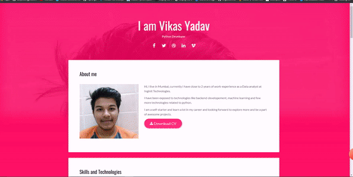

# Welcom to my Portfolio

## This portfolio is made by just using python only (no framework  in dev)

### A quick peek into it.

### This is done by a package called Gunicorn, more details below:

## ...

### >>>>Adding docker images soon!!

Gunicorn
--------

Gunicorn 'Green Unicorn' is a Python WSGI HTTP Server for UNIX. It's a pre-fork
worker model ported from Ruby's Unicorn_ project. The Gunicorn server is broadly
compatible with various web frameworks, simply implemented, light on server
resource usage, and fairly speedy.

Documentation
-------------

The documentation is hosted at https://docs.gunicorn.org.

Installation
------------

Gunicorn requires **Python 3.x >= 3.5**.

Install from PyPI::

    $ pip install gunicorn

Usage
-----

Basic usage::

    $ gunicorn [OPTIONS] APP_MODULE

Where ``APP_MODULE`` is of the pattern ``$(MODULE_NAME):$(VARIABLE_NAME)``. The
module name can be a full dotted path. The variable name refers to a WSGI
callable that should be found in the specified module.

Example with test app::

    $ cd examples
    $ gunicorn --workers=2 test:app
